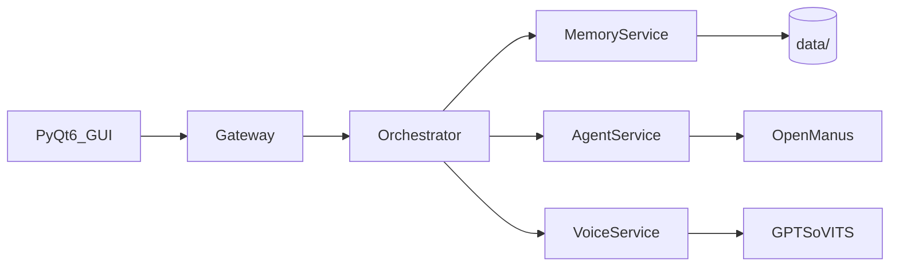

<div align="center">

**🌐 Language / 语言 / 言語**

[](README.md)
[](README_EN.md)
[](README_JA.md)

---

# 🤖 Project Local

**一个支持虚拟形象的本地 AI 桌面助手**

语音对话 · 智能记忆 · 工具调用 · 3D Avatar · 微服务编排

</div>

---

## 项目简介

Project Local 以本地优先为原则，整合 LLM 对话、语音链路、记忆系统、电脑控制与 Avatar 展示能力。
当前默认运行模式为 **microservices-only**：PyQt6 GUI 通过 Gateway 调用 Orchestrator 与后端服务。

## 系统架构



| 组件 | 端口 | 职责 |
|------|------|------|
| Gateway | 18080 | API 入口、认证、路由 |
| Orchestrator | 18081 | 对话编排、LLM 调度 |
| Memory Service | 18082 | 记忆存储与检索 |
| Agent Service | 18083 | 工具执行、浏览器自动化 |
| Voice Service | 18084 | ASR / TTS 链路 |

数据流：`用户输入 → Gateway → Orchestrator → [Memory/Agent/Voice] → 响应 → GUI/Avatar`

## 核心能力

- 智能对话：支持多轮上下文与工具调用。
- 语音交互：ASR + TTS 串联，支持本地化运行。
- 记忆系统：短期/长期记忆与偏好更新。
- 虚拟形象：表情与口型联动。
- 工具生态：文件操作、网页检索、Python 执行等。

## 性能加速（本次更新）

### 1) Rust 网页抓取加速

- 路径：`rust_modules/web_fetcher_rs`
- 新增能力：Rust 扩展提供批量抓取接口 `fetch_content_batch(urls, timeout, max_chars)`。
- Python 集成：`WebContentFetcher` 优先走 Rust 批量路径，并保持降级逻辑。
- 优化点：复用共享 HTTP Client，减少重复构建开销。

### 2) Agent Tool 全局调度加速

- 路径：`modules/openmanus/app/tool/tool_collection.py`
- 新增能力：
  - `to_params()` 结果缓存
  - `execute_many()` 批量执行
  - 有界并发执行（可配置）
  - 执行统计 `get_stats()`
- Agent 集成：`modules/openmanus/app/agent/toolcall.py` 使用批量执行路径。

### 3) C++ 语音生成链路加速

- 路径：`cpp_modules/voice_cpp_engine`、`modules/voice.py`、`modules/voice_cpp_accel.py`
- 新增能力：
  - C++ 音频分块索引接口 `build_chunk_index_cpp(total_size, chunk_size, ...)`
  - Python `tts_worker` 在缓存命中与缓冲回退路径下优先使用 C++ 分块
  - 保留 Python 分块回退，确保旧版库/异常场景不影响可用性
- 统计指标：新增 `cpp_chunk_accel_success`、`cpp_chunk_accel_errors`，用于观测分块加速命中率。

### 并发开关

| 环境变量 | 默认值 | 说明 |
|---|---|---|
| `OPENMANUS_TOOL_PARALLEL_ENABLED` | `1` | 是否启用并行 tool 调度 |
| `OPENMANUS_TOOL_PARALLEL_MAX` | `4` | 最大并发度 |
| `WEB_FETCHER_RS_PY_EXT` | 空 | 可选，指定 Rust 扩展 `.pyd/.so` 路径 |

说明：以下工具默认串行执行以保证安全性：
`python_execute`、`str_replace_editor`、`file_operator`、`terminate`、`browser_use`、`tool_selector`。

## 快速开始

### 方式一：Windows 批处理脚本（推荐）

```batch
git clone https://github.com/CHANGE_ME/local-project.git
cd local-project

REM 安装核心依赖（推荐 scripts/ 目录）
scripts\install.bat

REM 或根目录兼容入口
install_dependencies.bat

REM 安装完整依赖（含 PyTorch + GPT-SoVITS）
scripts\install.bat -Torch -GptSovits

REM 启动项目
scripts\start.bat
```

可先执行环境检查：`scripts\check.bat` 或 `check_runtime.bat`

**配置说明：** 复制 `.env.example` 为 `.env` 并填写 `ARK_API_KEY`；可选创建 `project_config.yaml` 覆盖 `config/` 分层配置。

**安装参数说明：**

| 参数 | 说明 |
|------|------|
| `-Dev` | 安装开发/测试依赖 |
| `-Mirror` | 使用清华镜像源加速 |
| `-Torch` | 安装 PyTorch (CUDA 12.1) |
| `-GptSovits` | 安装 GPT-SoVITS 语音合成依赖 |
| `-Optional` | 安装可选依赖 (Docker, AWS, 爬虫等) |
| `-All` | 安装所有依赖 |

### 方式二：系统 Python / 虚拟环境

```powershell
git clone https://github.com/CHANGE_ME/local-project.git
cd local-project

python -m venv .venv
.\.venv\Scripts\Activate.ps1

REM 安装核心依赖
python -m pip install -r requirements.txt

REM 安装 PyTorch（要求 >=2.6.0，根据 CUDA 版本选择）
python -m pip install "torch>=2.6.0" "torchaudio>=2.6.0" "torchvision>=0.21.0" --index-url https://download.pytorch.org/whl/cu121

REM 安装 GPT-SoVITS 依赖（可选）
python -m pip install transformers huggingface_hub peft librosa soundfile pypinyin cn2an

python main.py
```

### 方式三：Poetry

```powershell
git clone https://github.com/CHANGE_ME/local-project.git
cd local-project

poetry install
poetry run python main.py
```

### 方式四：Docker（仅后端微服务栈）

GUI 仍在宿主机运行；容器内启动 Gateway / Orchestrator / 各后端服务。

```powershell
copy docker\.env.example docker\.env
# 编辑 docker\.env，设置 GATEWAY_API_KEY

docker compose -f docker/docker-compose.yml build
docker compose -f docker/docker-compose.yml up -d

# 或使用 Makefile
make docker-build
make docker-up
```

根目录 `docker-compose.yml` 为兼容入口，实际编排见 [`docker/docker-compose.yml`](../docker/docker-compose.yml)。

### Linux / macOS

```bash
chmod +x scripts/install.sh scripts/start.sh
./scripts/install.sh
./scripts/start.sh
```

## 可选：构建 Rust 抓取扩展

```powershell
python -m pip install maturin
python -m maturin develop --manifest-path rust_modules/web_fetcher_rs/Cargo.toml
```

如果你使用非默认工具链，请确保 Rust/Cargo 可用并与本地 Python ABI 匹配。

## 可选：构建 C++ 语音加速库

```powershell
cmake -S cpp_modules/voice_cpp_engine -B build/voice_cpp_engine -DCMAKE_BUILD_TYPE=Release
cmake --build build/voice_cpp_engine --config Release
```

## 测试

```powershell
python -m pytest -q
```

关键回归用例：

```powershell
python -m pytest tests/test_openmanus_web_search_fetcher.py -q
python -m pytest tests/test_openmanus_browser_enhancements.py -q
python -m pytest tests/test_voice_tts_chain.py -q
```

## 项目结构

```text
Local-project/
├── main.py                      # GUI 入口（PyQt6 + qasync）
├── application.py               # GUI 应用编排
├── config/                      # 分层配置（default / development / production）
├── docker/                      # Docker 镜像与 compose 编排
├── scripts/                     # 安装与启动脚本（install/start/check）
├── assets/                      # Avatar 模型、参考音频
├── data/                        # 运行时数据（日志、记忆，gitignore）
├── modules/                     # 核心业务模块
│   ├── agent/                   # Agent 桥接
│   ├── application/             # GUI 子控制器
│   ├── avatar/                  # 虚拟形象
│   ├── memory/                  # 记忆系统
│   ├── openmanus/               # Agent 框架（vendor）
│   └── gpt_sovits/              # 语音合成（vendor）
├── microservices/               # FastAPI 微服务
│   ├── gateway/
│   ├── orchestrator/
│   ├── agent_service/
│   ├── memory_service/
│   ├── voice_service/
│   └── shared/
├── cpp_modules/voice_cpp_engine/  # C++ 语音加速
├── rust_modules/web_fetcher_rs/   # Rust 网页抓取
├── tests/
└── docs/
```

## Gateway API 摘要

| 方法 | 路径 | 说明 |
|------|------|------|
| GET | `/health` | 健康检查 |
| GET | `/v1/status/services` | 聚合服务状态 |
| POST | `/v1/chat` | 对话接口（非回环需 `x-api-key`） |

详见 [`OPS_HEALTH.md`](OPS_HEALTH.md) 与 [`SECURITY.md`](SECURITY.md)。

## 故障排除（节选）

| 现象 | 处理 |
|------|------|
| `h2 package is not installed` | `pip install "httpx[http2]" h2` |
| 网关启动失败（非回环） | 设置 `GATEWAY_API_KEY` 或 `gateway.api_key` |
| PyTorch 版本冲突 | 升级至 `torch>=2.6.0`（见 DEPENDENCIES.md） |
| Docker Gateway 拒绝启动 | 在 `docker/.env` 中设置 `GATEWAY_API_KEY` |
| 缺少本地密钥 | 复制 `.env.example` → `.env`，可选 `project_config.yaml` |

更多运维命令见 [`OPS_HEALTH.md`](OPS_HEALTH.md)；依赖问题见 [`DEPENDENCIES.md`](DEPENDENCIES.md)。

## 相关文档

- 中文开发指南：`CONTRIBUTING.md`
- English Developer Guide: `CONTRIBUTING_EN.md`
- 日本語開発ガイド：`CONTRIBUTING_JA.md`
- 依赖与可复现构建：[DEPENDENCIES.md](DEPENDENCIES.md)
- 安全与威胁面：[SECURITY.md](SECURITY.md)
- 健康检查与运维：[OPS_HEALTH.md](OPS_HEALTH.md)
- 仓库元数据（发布前替换占位 URL）：[METADATA.md](METADATA.md)

## 许可证

MIT，详见 [LICENSE](../LICENSE)。
